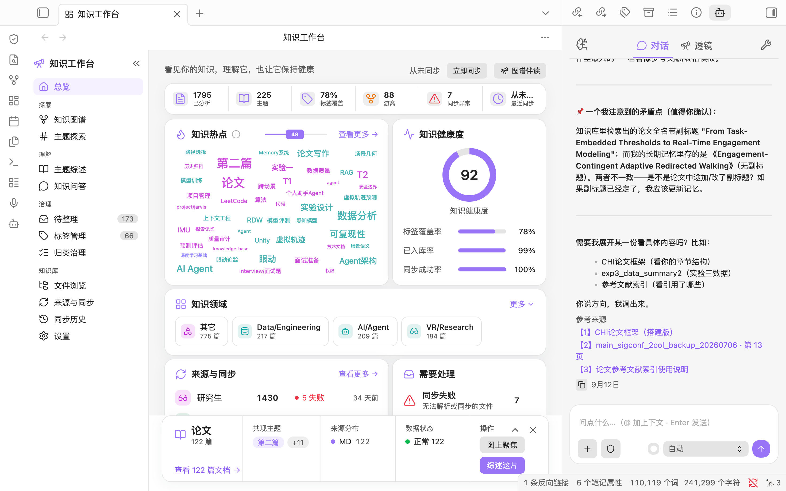
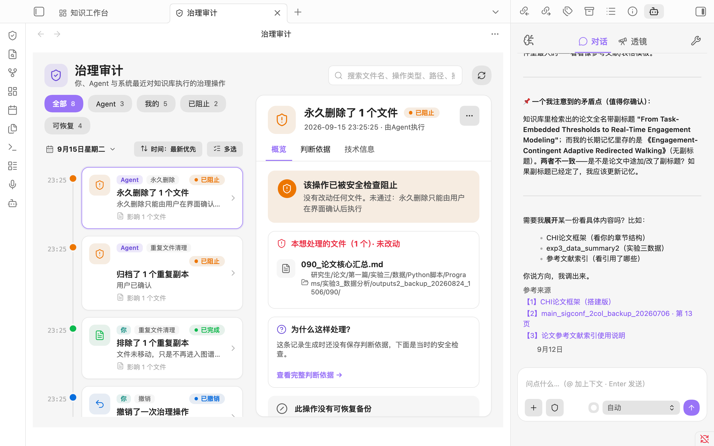

# Jarvis Agent Demo

一个面向面试审阅的、可独立运行的 Agent 技术切片，而非个人助理的完整产品或个人知识库备份。

> 目标：让面试官在几分钟内理解我如何把 RAG、Agent 工具调用、风险自适应权限控制和可复现评测组合成一个可维护的个人知识助手。



*Jarvis 知识工作台：将知识库的主题、健康度、来源同步与对话入口收敛到同一工作区。*



*Jarvis 治理审计：高风险操作必须经过安全检查；审计记录说明操作主体、影响范围、判断依据和结果。*

## 想解决什么问题？

个人知识库里的信息并不只需要“搜得到”。一个真正可用的助手还需要：

1. 在笔记、项目文件和历史上下文中找到可靠证据；
2. 判断何时应该检索、何时应该调用工具，而不是把所有问题都塞进向量库；
3. 在写文件、联网或处理高风险请求前做恰当的确认；
4. 在检索策略迭代后，用可复现指标知道它是否真的变好了。

完整的私有项目围绕这些问题持续演进。本仓库保留其中最适合公开审阅的最小闭环。

## 展示的工程判断

### 1. RAG：混合召回，而非单一搜索

Demo 将词项相似度与稀有关键词信号融合，输出带来源和分数的候选结果。生产版可在不改变上层接口的前提下替换为本地嵌入、向量索引和重排器。

```text
示例文档 → 规范化 / 分词 → 两路召回信号 → 融合排序 → 带来源的结果
```

### 2. Agent：工具契约与风险契约分离

每个工具同时有两份声明：

- `ToolSpec`：名称、说明、参数 JSON Schema，供模型理解“能做什么”；
- `ToolRisk`：动作类型、影响范围、可恢复性、影响等级，供权限策略判断“能否做”。

模型不能通过描述文字绕开安全判断；安全策略读取结构化风险元数据，而不是依赖工具名称或提示词约定。

### 3. 权限：三档全局模式，不为每个新工具手配规则

| 模式 | 行为 |
| --- | --- |
| 请求批准 | 除只读外的操作都询问用户 |
| 智能批准 | 仅自动放行范围受限、可恢复、低影响的操作 |
| 完全访问 | 已授权范围内自动执行；删除等不可逆动作仍强制确认 |

这避免“每新增一个工具就新增一条权限规则”的维护负担，同时保留危险操作的硬边界与审计依据。

### 4. 评测：先做确定性回归，再引入 LLM 裁判

`Recall@K` 衡量相关资料是否被前 K 条检索结果覆盖，`MRR` 衡量第一条相关结果的排序位置。它们不消耗模型 Token、可在 CI 或本地稳定复跑，因此适合作为检索策略改动的第一道回归门。

## 运行

```bash
git clone https://github.com/Jarvis-AI-W/Jarvis-Agent-Demo.git
cd Jarvis-Agent-Demo
python -m pytest
python -m src.demo
```

预期输出会展示一个检索问题、按分数排序的来源、Recall@3 / MRR，以及一个低风险受限写入工具在“智能批准”模式下的决策。

## 仓库结构

```bash
src/rag/          # 可替换的混合检索接口与实现
src/tools/        # ToolSpec、ToolRisk 与受限写入示例
src/permissions/  # 三档风险自适应策略
src/evaluation/   # Recall@K、MRR
tests/            # 可复现的行为测试
examples/         # 虚构的 Markdown 示例资料
assets/           # 产品能力展示截图
```

## 公开范围与边界

这个仓库刻意不包含：个人 Obsidian 知识库、真实 API Key、模型地址、绝对路径、真实评测数据、完整产品 UI 和部署配置。

展示截图用于说明产品形态；可运行代码则只保留能够独立审阅和复现的技术骨架。这样面试官能看到工程判断，完整个人系统与私有资料仍保持隔离。

## 后续演进

生产版会在这个边界上继续接入持久化索引、本地嵌入模型、重排器、Agent 续作、异步任务恢复和 LLM-as-a-judge 评测流水线；这些依赖个人资料或部署环境的部分有意不在本仓库公开。
